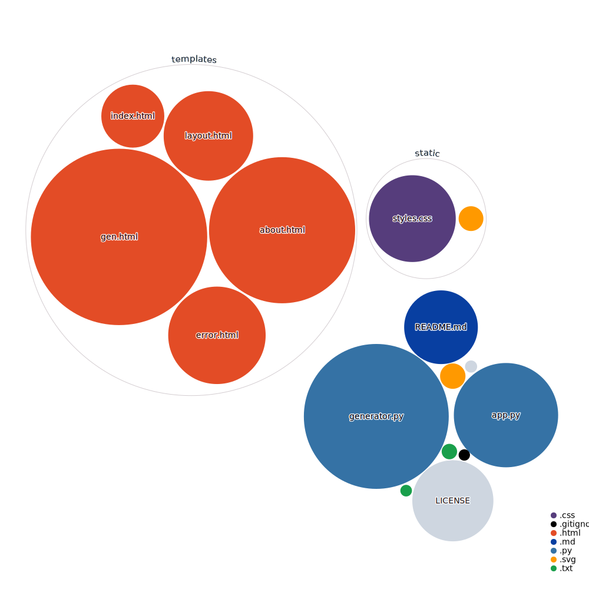

# Tweet Gen

A web app allowing you to create unique Tweets in the style of any Twitter user. Utilises a Markov chain generator within the domain of natural language processing.

- Python backend; HTML/CSS/JavaScript frontend
- [Flask](https://flask.palletsprojects.com/en/1.1.x/) framework
- Uses [Twitter API](https://developer.twitter.com/en)
- Markovify models created with [Markovify](https://github.com/jsvine/markovify)
- Deployed on [Heroku](https://www.heroku.com/home)

## Repo visualizer

Experimenting with the [repo-visualizer](https://github.com/githubocto/repo-visualizer) GitHub Action. Read more [here](https://next.github.com/projects/repo-visualization) if interested.

